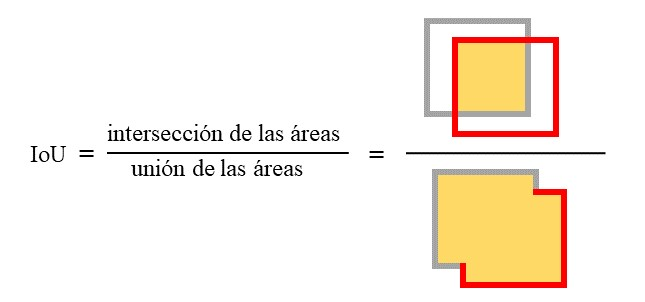

# Detection Transformers(DETR) finetuning

## DETR arquitectura

DETR también llamado DEtection TRansformer, considera la detección de objetos como un problema estimaciones de conjuntos. No utiliza técnicas como la non-maximum suppression (NMS), ya que, fuerza predicciones únicas a través de un emparejamiento bipartito (bipartite matching). Este aprende sobre las relaciones de los objetos y el contexto de la imagen global para generar directamente el conjunto final de predicciones.

La filosofía de end-to-end ha dado lugar a avances significativos en tareas complejas de predicción estructurada como la traducción automática o el reconocimiento de voz. Así pues, DETR adopta la arquitectura de encoder-decoder basada en transformers, una arquitectura popular para la predicción de secuencias. 

De primeras DETR usa capas convolucionales para optener un vector de características para pasarle al transformer encoder-decoder. El transformer no es consciente de la estructura 2D de la imagen debido a que se aplana (capa flatten), por lo que, para conservar la estructura 2D se añaden codificaciones posicionales similar a lo que se realiza en las NLP. Este aplanamiento se realiza ya que el transformer es un procesador de secuencias de forma natural.

El transformer basicamente se centra en calcular los denominados mapas de atención para obtener la relacion entre los distintos puntos de la imagen situados de forma secuencial. 


El transformer encoder-decoder produce pares de etiquetas y bounding box, es decir, para cada bounding box tenemos una etiqueta. Esta arquitectura produce internamente bounding box pertenecientes a la clase "Ninguna clase", que son todas aquellas detecciones que no se encuentran anotadas en el conjunto de entrenamiento (fondo o otros objetos). Estos bounding box pertenecientes a ninguna clase o incluso bounding box solapados se eliminan con lo denominado **bipartite matching loss**. 

La función deonimnada bipartite matching loss se podría considerar como una heurística, para evitar que un mismo objeto se lleve toda la atención de la imagen y sea detectado continuamente se usa lo denominado maximum matching. Esto funciona tomando en parejas los distintas bounding box detectados con la verdad etiquetada (includa los supuestos etiquetados de ninguna clase) y calcular su relación, así, se obtendrá si esos bounding boxes son equivalentes y como de equivalentes son. Para limitar la equivalencia hay que definir un umbral (minimum matching), así sabemos a partir de que valor consideramos dos bounding box equivalentes.

Para calcular la equivalencia de los dos bounding box de forma que no inluya el tamaño mínimo y máximo de bounding box, tal y como pasa en otross detectores, se utiliza la Intersección sobre Unión (IoU) en el cálculo, ya que es independiente de la escala. Definiendo los umbrales necesarios como hiperparámetros. 

IoU evalúa la superposición entre dos máscaras. Se calcula como el área de intersección de ambas, dividida por el área de unión de los dos. La métrica de IoU oscila entre 0 y 1, donde 0 significa que no hay superposición y 1 implica una superposición perfecta.



El segundo paso, una vez calculado todos los emparejamientos de pares de bounding box con sus etiquetas, es calcular la función de pérdida **Hungarian loss**. Esta está definida de forma similar a la utilizada en los detectores comunes. La Hungarian loss también realiza el puntuaje del bouding box directamente, a diferencia de otros detectores.


Es decir, dentro del DETR el encoder se encarga de obtener un mapa de características tanto con los valores de la imagen como con las codificaciones posicionales, para luego pasarlo al decoder. El decorder se encagar principalmente de a partir de una secuencia obtener otra secuencia, del mismo tamaño, incluyendo la información obtenida del encoder. Las secuencias de entrada del decoder es lo que se denomina **queries**, mientras que las secuencias de salida serían los pares de predicciones (bouding box con su etiqueta correspondiente). 


En esta imagen podemos visualizar un ejemplo de auto-atención del encoder para un conjunto de puntos de referencia. Las cabeceras de atención del DETR pueden ser usadas para una segmentación panóptica añadiendo capas en la parte superior de las salidas del decodificador.


## Requisitos
Para esta práctica se estará usando Jupyter notebook desde un entorno de Anaconda, por lo que realizaremos las instalaciones de todo lo necesario por la consola de Anaconda (Anaconda prompt), por ejemplo para instalar la libería extra de pythorch llamada vision: https://github.com/pytorch/vision.
```{bash}
conda install torchvision -c pytorch 
``` 

En este proyecto hace falta instalar:
+ Pandas
+ OpenCV
+ Sklearn
+ Albumentations
+ Pillow (PIL)
+ Pytorch (para CUDA)
+ Torchvision

Antes de proceder a implementar el modelo hay que copiar el repositorio de DETR de Facebook ya que contiene implemetaciones necesarias para la arquitectura como su función de pérdida denonimada **Bipartite Matching loss**, en la que se asigna un bbox de verdad de terreno a un cuadro predicho usando un comparador tanto, cuando se realiza un ajuste fino, necesitamos el comparador (por ejemplo, **hungarian matcher** que se usa en el paper),también necesitamos la función **SetCriterion** que le da a la función de pérdida el backpropogation.

Por lo tanto utilizaremos git, para clonar el repositorio desde github a nuestro equipo utilizando la consola:
```{bash}
git clone https://github.com/facebookresearch/detr.git 
``` 

## Dataset 
El conjunto de datos utilizado es un subconjunto de [**Open Images V6**](https://storage.googleapis.com/openimages/web/index.html) que contiene 300 imágenes de pandas rojos y 300 de ratones.

Para descargar las imágenes de Open Images V6 hay que instalar: 
```{bash}
pip install oidv6
``` 
Para descargar las imágenes hay que ejecutar por consola el oidv6, indicando la carpeta donde descargar las imágenes, la clase o clases a descargar y el limite de imágenes. Las instrucciones de uso se encuentran en el Github de [DmitryRyumin](https://github.com/DmitryRyumin/OIDv6). En nuestro caso se ejecutó:
```{bash}
oidv6 downloader en --dataset TransformerDataset\ --type_data train --classes "Red panda" --limit 300 --yes
oidv6 downloader en --dataset TransformerDataset\ --type_data train --classes "Mouse" --limit 300 --yes
```

Ejemplo de las imágenes utilizadas:  

    
    

Las imágenes descargadas contienen las etiquetas en un txt por imagen, por lo que se realizará las trasformaciones necesarias para guardarlas todas en un archivo csv y poder utilizarlas como conjunto de entrenamiento. Ver Notebook  [Labels to CSV DataFrame](https://github.com/Crisyaki/finetune-detr/blob/main/Labels%20to%20CSV%20DataFrame.ipynb).


